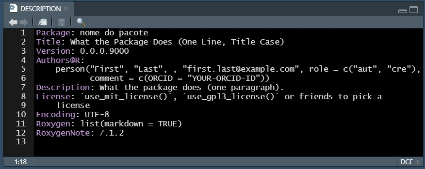
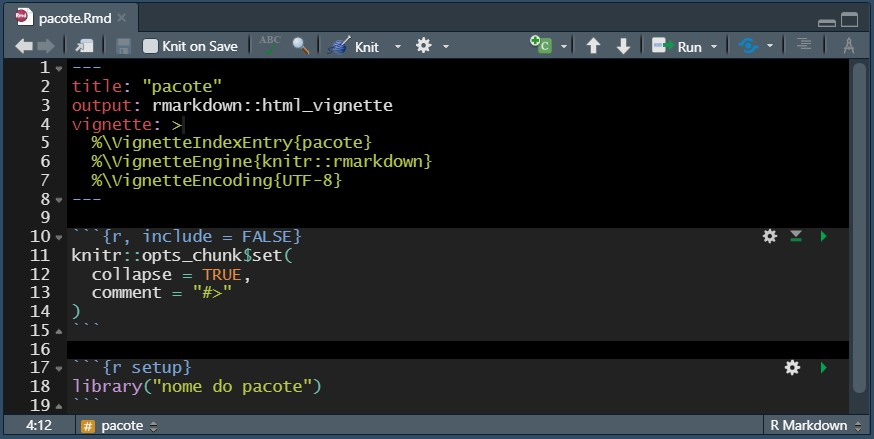
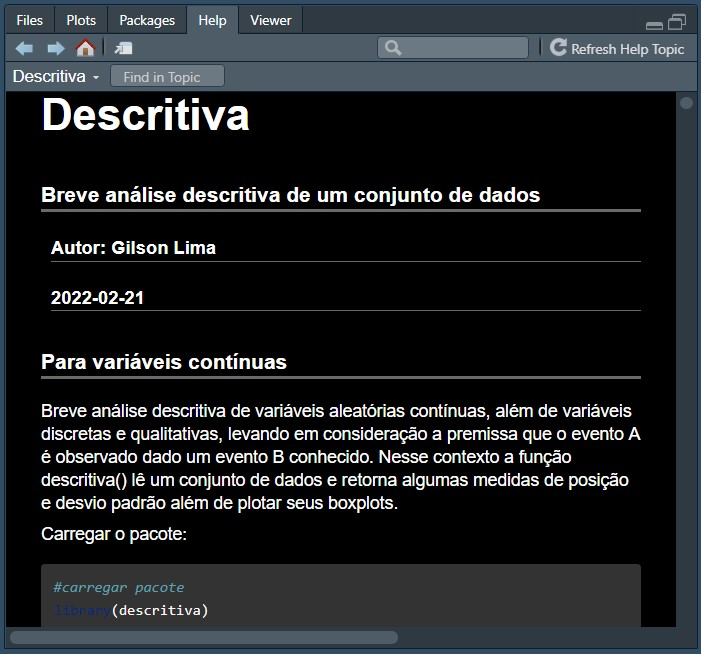
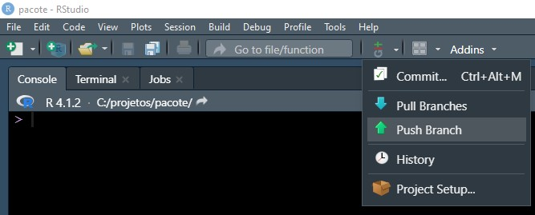

class: right, middle
```{r setup, include=FALSE}
options(htmltools.dir.version = FALSE)
knitr::opts_chunk$set(
  fig.width=9, fig.height=3.5, fig.retina=3,
  out.width = "100%",
  cache = FALSE,
  echo = TRUE,
  message = FALSE, 
  warning = FALSE,
  hiline = TRUE
)
```

```{r xaringan-themer, include=FALSE, warning=FALSE}
library(xaringanthemer)
style_mono_accent(
  base_color = "#0B3C1A",
  header_background_auto = FALSE,
  header_font_google = google_font("Roboto Mono"),
  text_font_google   = google_font("Work Sans", "400", "400i"),
  code_font_google   = google_font("IBM Plex Mono")
)
```

```{r xaringan-tile-view, echo=FALSE}
xaringanExtra::use_tile_view()
```

<!--Slide 1 epígrafe-->

<h2 style="padding-bottom:40px;">“How many bricks would it take to make that nose?”</h2>
<span style="color:#28872B"><b>Dagny Holm</b></span>, designer-chefe de modelos do Grupo LEGO até 1986

---

background-image:linear-gradient(#0B3C1A, #0B3C1A 30%, white 30%, white)

<!--início slide-->
 
.left-column[

]

.right-column[

<h2 style="color:white; font-size:48pt;">Sumário</h2> <!--título sumário-->

1.  **Introdução**

1.  **Etapas Metodológicas**

1.  **Desenvolvimento**

1.  **Pacote descritiva**

1.  **Conclusão**
]

---

class:center, middle, inverse

<h1 style="font-size:44pt;">1.Introdução</h1> <!--slide passagem-->

---

layout: true

#1.Introdução   <!--titulo layout-->

---

class: header_background

## Contextualização, motivação e abordagem <!--início slide-->

--
count: false
- Parte do projeto <span style="color:#28872B;">Estudo da Relação de Incidência de COVID-19 entre Regiões utilizando Redes Bayesianas</span>

- Desenvolver sistema de <span style="color:#28872B;">inteligência artificial reprodutível</span> a partir de uma aborgadem <span style="color:#28872B;">bayesiana</spam>

--
count: false
- <span style="color:#28872B;">Disponibilizar ferramenta estatística bayesiana</span> e dessa maneira ampliar as opções para a comunidade de usuários do R

--
count: false
- Elaborar <span style="color:#28872B;">tutorial</span> para criação de pacotes

- Implementar pacote `descritiva`

---

class: header_background

## Objetivos    <!--início slide-->

--
count: false
- Estudo dos métodos de <span style="color:#28872B;">Inteligência Artificial</span> baseados em redes bayesianos

--
count: false
  - Naïve Bayes
  
  - <span style="color:#28872B;">Alpha Skew Gaussian Naïve Bayes (ASGNB)</span>
  
--
count: false
- Estudo das Linguagens R e C, bem como demais ferramentas
computacionais necessárias

--
count: false
  - <span style="color:#28872B;">Tutorial</span> para criação de pacotes
  
--
count: false
- Implementação do método em <span style="color:#28872B;">pacote para Linguagem R</span>

--
count: false
  - Pacote `descritiva`
  
  - Parâmetros da função densidade de probabilidade da distribuição ASG

---

class: inverse, center, middle
layout: false

<h1 style="font-size:44pt;">2.Etapas Metodológicas</h1>   <!--slide passagem-->

---

layout: true

# 2.Etapas Metodológicas <!--slide layout-->

---

class: header_background

## Plano de trabalho    <!--início slide-->
--
count: false
Etapa | Set | Out | Nov | Dez | Jan | Fev | Mar | Abr | Mai | Jun | Jul | Ago
----- | :-: | :-: | :-: | :-: | :-: | :-: | :-: | :-: | :-: | :-: | :-: | :-: 
I. Revisão bibliográfica e estudo referente às redes bayesianos | X | X | X | X | | | | | | | | 
II. Estudo referente às ferramentas computacionais semelhantes disponíveis em Linguagem R | | X | X | X | X | | | | | | | 
III. Estudo referente a plataformas de versionamento Git/Github | | | | X | X | | | | | | | 
IV. Estudo referente a conexão Linguagem R e Linguagem C | | | X | X | X | X | | | | | | 
V. Implementação inédita dos métodos estudados em Linguagem R | | | | | X | X | X | | | | | 
VI. Protótipo da biblioteca de implementação inédita | | | | X | X | X | X | X | | | | 
VII. Estudo de performance da biblioteca para dados simulados e reais | | | | | | | | X | X | X | | 
VIII. Relatório Final e submissão da biblioteca ao CRAN | | | | | | X | X | X | X | X | X | X 

---

layout: false

class:center, middle, inverse

<h1 style="font-size:44pt;">3.Desenvolvimento</h1>    <!--slide passagem-->

---

layout: true

# 3.Desenvolvimento   <!--slide layout-->

---

class: header_background

## Estratégia   <!--início slide-->

--
count: false
- Elaboração de um <span style="color:#28872B;">tutorial</span> para criação de pacotes

--
count: false
  - Estudo das Linguagens R e C, bem como demais ferramentas computacionais
  necessárias

--
count: false
     - Etapa III. Estudo referente a plataformas de versionamento Git/Github

---

class: header_background

<h2 style="padding-bottom: 10px">Estratégia</h2>    <!--início slide-->

- Desenvolvimento de pacote `descritiva`

--
count: false
  - Estudo dos métodos de Inteligência Artificial baseados em redes bayesianos
  
  - Implementação dos métodos em pacotes em Linguagem R

--
count: false
      - I. Revisão bibliográfica e estudo referente às redes bayesianos	
      
      - II. Estudo referente às ferramentas computacionais semelhantes disponíveis em Linguagem R
      
      - IV. Estudo referente a conexão Linguagem R e Linguagem C	
      
      -  V. Implementação inédita dos métodos estudados em Linguagem R
      
      - VI. Protótipo da biblioteca de implementação inédita
      
      - VII. Estudo de performance da biblioteca para dados simulados e reais	

---

class: header_background

## Perguntas importantes    <!--início slide-->

- Por que criar pocotes?
--
count:false
> *"Em R, a <span style="color:#28872B;">unidade fundamental do código compartilhável</span> é o pacote..."<br>
"...qualquer coisa que possa ser automatizada, <span style="color:#28872B;">deve ser automatizada."</span>*<br><span class="text-align: right" style="color:#28872B;font-size:16pt">— Wickham & Bryan</span>

  - <span style="color:#28872B;">Compartilhar</span> e <span style="color:#28872B;">reutilizar</span>
  
  - <span style="color:#28872B;">Reprodutibilidade</span>
  
  - <span style="color:#28872B;">Padronização</span> do código
  
  - Estimula a <span style="color:#28872B;">documentação</span>

---

class: header_background

## Perguntas importantes    <!--início slide-->

- Reutilizar? Como compartilhar?
  
--
count:false
  - <span style="color:#28872B;">Funções</span>
--
conut:false
  - **Git** e **Github**
  
      - Sistema de <span style="color:#28872B;">controle de versão</span>
    
      - <span style="color:#28872B;">Repositório</span> com histórico de alterações
    
      - <span style="color:#28872B;">Armazenar</span> e <span style="color:#28872B;">compartilhar</span>
      
      - Especialmente util em <span style="color:#28872B;">projetos colaborativos</span>

---

class: header_background

## Perguntas importantes    <!--início slide-->

- Como garantir a reprodutibilidade?
--
count:false

  - Genrenciamento de dependências
  
      - `renv`
      
      - Criar ambientes reproduzíveis para cada projeto tornando-os:
    
          - Isolados
    
          - Portáteis

          - Reprodutíveis
      
---

class: header_background

## Perguntas importantes    <!--início slide-->

- Por que documentar?

>*"A documentação é um dos aspectos mais importantes de um bom pacote. <span style="color:#28872B";>Sem ela, os usuários não saberão como usar seu pacote.</span> A documentação também é útil para você no futuro (...) e para desenvolvedores que estendem seu pacote."*<br><span class="text-align: right" style="color:#28872B;font-size:16pt">— Wickham & Bryan</span>

---

class: header_background

<h2 style="padding-bottom: 10px">Tutorial para criação de pacotes</h2> <!--início slide-->

- Pré requisitos
--
count:false

  - [R](https://www.r-project.org/)

  - [Rtools](https://cran.r-project.org/bin/windows/Rtools/rtools40.html)

  - [RStudio](https://www.rstudio.com/)

  - [Git](https://git-scm.com/)

  - Criar conta no [Github](https://github.com/)

  - `devtools`

  - `knitr`

  - `rmarkdown`

  - `renv`


---

class: header_background

<!--início slide-->

<h3 style="padding-top: 15px; margin-bottom:-25px"><span style="color:#28872B;">Tutorial para criação de pacotes</h3>

<h2 style="padding-bottom: 125px">Fluxo de trabalho</h2>

<br>

.center[]

---

class: header_background

<!--início slide-->

<h3 style="padding-top: 15px; margin-bottom:-25px"><span style="color:#28872B;">Tutorial para criação de pacotes</h3>

##Novo pacote

--
count:false

.pull-left2[

- Iniciar o RStudio

- Criar estrutura mínima no pacote
  ```{r eval=FALSE}
  usethis::create_package("caminho")
  ```
   - .gitignore

   - .Rbuildignore

   - DESCRIPTION

   - NAMESPACE
   
   - /R
]

.pull-right2[

.center[]

]

---

class: header_background

<!--início slide-->

<h3 style="padding-top: 15px; margin-bottom:-25px"><span style="color:#28872B;">Tutorial para criação de pacotes</h3>

<h2 style="padding-bottom:5px">Editar</h2>
--
count:false
- Arquivo <span style="color:#28872B;">DESCRIPTION</span>

<center></center>
--
count:false

- Incluir <span style="color:#28872B;">licença</span>

```{r eval=FALSE}
usethis::use_mit_license() # Licença MIT
```

---

class: header_background

<!--início slide-->

<h3 style="padding-top: 15px; margin-bottom:-25px"><span style="color:#28872B;">Tutorial para criação de pacotes</h3>

##Editar

- Adicionar <span style="color:#28872B;">funções</span>

```{r eval=FALSE}
usethis::use_r("função") # Cria e abre o arquivo /R/função.R
```
--
count:false

- Editar função.R

  - Chamar funções <span style="color:#28872B;">explicitamente</span>

  - Caso função.R utilize funções de outros pacotes

```{r eval=FALSE}
usethis::use_package("pacote") # Adiciona Imports: "pacote" ao DESCRIPTION
```

--
count:false
- <span style="color:#28872B;">Carregar</span> função.R para verificar funcionamento

```{r eval=FALSE}
devtools::load_all() #ou o atalho <Ctrl + Shift + l>
```

---

class:header_background

<!--início slide-->

<h3 style="padding-top: 15px; margin-bottom:-25px"><span style="color:#28872B;">Tutorial para criação de pacotes</h3>

<h2 style="padding-bottom:5px">Editar</h2>

- Criar estrutura mínima de <span style="color:#28872B;">documentação</span>

  - Na barra de menu acessar `Code > Insert Roxygen Skeleton` ou o atalho `ctrl + shiht + alt + r`
  
  - Preencher título e campos `@`

.center[]

---

class: header_background

<!--início slide-->

<h3 style="padding-top: 15px; margin-bottom:-25px"><span style="color:#28872B;">Tutorial para criação de pacotes</h3>

##Editar

- Gerar <span style="color:#28872B;">documentação</span>
  ```{r eval=FALSE}
  devtools::documment() # ou o atalho <ctrl + shift + d>
  ```
  - /man

  - /man/função.Rd
--
count:false

- <span style="color:#28872B;">Checar</span> pacote em busca de erros

```{r eval=FALSE}
devtools::check()
0 errors √ | 0 warnings √ | 0 notes √ # Retorno esperado
```

---

class: header_background

<!--início slide-->

<h3 style="padding-top: 15px; margin-bottom:-25px"><span style="color:#28872B;">Tutorial para criação de pacotes</h3>

## Editar

Adicionar <span style="color:#28872B;">vignettes</span>

> *"Uma vignette é um guia de formato longo para o seu pacote (...) pode descrever o problema que seu pacote foi projetado para resolver e, em seguida, mostrar ao leitor como resolvê-lo"*<br> .right[<span style="color:#28872B;">— Wickham & Bryan</span>]

```{r eval=FALSE}

browseVignettes() # Para vizualizar todas as vignettes instaladas

```

---

class: header_background

<!--início slide-->

<h3 style="padding-top: 15px; margin-bottom:-25px"><span style="color:#28872B;">Tutorial para criação de pacotes</h3>

## Editar

- Criar <span style="color:#28872B;">vignette</span>
  ```{r eval=FALSE}
  usethis::use_vignette()
  ```
  - /vignette
  
  - /vignette/função.Rmd
  
  - Modifica <span style="color:#28872B;">DESCRIPTION</span>

        - <span style="color:#28872B;">Suggests:</span> `knitr`, `rmarkdown` e <span style="color:#28872B;">VignetteBuilder:</span> `knitr`, `rmarkdown`

---

class: header_background

<!--início slide-->

<h3 style="padding-top: 15px; margin-bottom:-25px"><span style="color:#28872B;">Tutorial para criação de pacotes</h3>

<h2 style="padding-bottom:0px">Editar</h2>

- Arquivo <span style="color:#28872B;">função.Rmd</span>

<center></center>
--
count:false

- `Crtl + Shift + k` para `knit` e visualizar <span style="color:#28872B;">vignette</span>
--
count:false

- Executar `devtools::install()` para instalar o pacote

```{r eval=FALSE}
#Instalar pacote, criar arquivo e gerar vignette
devtools::install(build = TRUE, build_vignettes = TRUE)
```

---

class: header_background

<!--início slide-->

<h3 style="padding-top: 15px; margin-bottom:-25px"><span style="color:#28872B;">Tutorial para criação de pacotes</h3>

<h2 style="padding-bottom:0px">Visualizar documentação</h2>

```{r eval=FALSE}

help(package = "nome do pacote")

```
.pull-left[
<center></center>
]
.pull-rigth[
<center></center>
]

---

class: header_background

<!--início slide-->

<h3 style="padding-top: 15px; margin-bottom:-25px"><span style="color:#28872B;">Tutorial para criação de pacotes</h3>

## Gerenciar dependências
--
count:false

- Iniciar <span style="color:#28872B;">biblioteca local</span>
```{r eval=FALSE}
  renv::init() # Reconhece as depedências e cria o arquivo renv.lock #<<
```
--
count:false
- De maneira semelhante, utiliza-se `renv::snapshot()` quando já existe uma biblioteca local
```{r eval=FALSE}
  renv::snapshot() # Reconhece novas depedências e atualiza renv.lock
```
--
count:false
- Já de maneira oposta, `renv::load()` é utilizado para <span style="color:#28872B;">carregar</span> um estado anterior salvo em renv.lock
```{r eval=FALSE}
  renv::load() # Carrega dependências listadas no arquivo renv.lock
```
  
---

class: header_background

<!--início slide-->

<h3 style="padding-top: 15px; margin-bottom:-25px"><span style="color:#28872B;">Tutorial para criação de pacotes</h3>

<h2 style="padding-bottom:15px">Versionamento (Git + Github)</h2>
--
count:false

- Configurar o <span style="color:#28872B;">Git</span>
--
count:false

```{r eval=FALSE}
# Apresentar-se ao Git (Essa etapa pode ser feita apenas uma vez)
usethis::use_git_config(user.name = "nome do usuário",
                        user.email = "contatol@email.com")

```
--
count:false
```{r eval=FALSE}
# Gerar token
usethis::create_github_token() 

```
--
count:false
```{r eval=FALSE}
# Armazenar token. Depois desse passo, reiniciar o R (Ctrl + Shift + F10)
gitcreds::gitcreds_set()
```
--
count:false
```{r eval=FALSE}
# Checar se configuração funcionou
usethis::usethis::git_sitrep()

```

---

class: header_background

<!--início slide-->

<h3 style="padding-top: 15px; margin-bottom:-25px"><span style="color:#28872B;">Tutorial para criação de pacotes</h3>

<h2 style="padding-bottom:5px">Versionamento (Git + Github)</h2>

Resultado do teste de configuração do <span style="color:#28872B;">Git</span>

<center></center>

---

class: header_background

<!--início slide-->

<h3 style="padding-top: 15px; margin-bottom:-25px"><span style="color:#28872B;">Tutorial para criação de pacotes</h3>

##Versionamento (Git + Github)

- Inicializar <span style="color:#28872B;">repositório</span>

```{r eval=FALSE}
usethis::use_git("Primeiro commit") # Cria repositório e commit inicial
```
--
count:false

- Enviar pacote para o <span style="color:#28872B;">Github</span>

```{r eval=FALSE}
usethis::use_github()
```
--
count:false

<br>
<center><h2>O pacote está online!</h2></center>

---

class: header_background

<!--início slide-->

<h3 style="padding-top: 15px; margin-bottom:-25px"><span style="color:#28872B;">Tutorial para criação de pacotes</h3>

##Versionamento (Git + Github)

.pull-left[
- Cliente <span style="color:#28872B;">Git</span> do <span style="color:#28872B;">Rstudio</span>

  - <span style="color:#28872B;">Stage</span>

  - <span style="color:#28872B;">Commit</span>

  - <span style="color:#28872B;">Push</span>
]

.pull-right[
<p style="font-size:5px"><br></p>
<center></center>
<center></center>

]

---

class: header_background

<!--início slide-->

<h3 style="padding-top: 15px; margin-bottom:-25px"><span style="color:#28872B;">Tutorial para criação de pacotes</h3>

<h2 style="padding-bottom:5px">Versionamento (Git + Github)</h2>

<h3><span style="color:#28872B;">Observações</span></h3>
--
count:false
- Sobre criação de pacote

  - Para <span style="color:#28872B;">clonar um projeto do Github</span>
```{r eval=FALSE}
usethis::create_from_github("caminho Github",
                            destdir = "caminho pasta",
                            fork = TRUE)
```

--
count:false
- Sobre instalação de pacotes do Gibhub

  - Para <span style="color:#28872B;">instalar o pacote do Github</span>
  
```{r eval=FALSE}
# Instalar e criar vignettes
devtools::install_github("caminho repositório", build_vignettes = TRUE) 

```

--
count:false
- Sobre <span style="color:#28872B;">desenvolvimento colaborativo utilizando Github</span> [clique aqui](https://beatrizmilz.github.io/slidesR/git_rstudio/11-2021-ENCE.html#51)

---
layout: true

<!--slide layout-->

# 4.Pacote descritiva

---
class: header_background

<!--início slide-->

## Breve análise descritiva

--
count: false
- Protótipo de <span style="color:#28872B;">pacote</span> capaz de fazer uma <span style="color:#28872B;">análise descritiva</span> de um conjunto de dados <span style="color:#28872B;">sob uma ótica condicional</span>

--
count: false
- Possui as funções:

--
count: false
  - `descritiva()`, <span style="color:#28872B;">análise descritiva</span>, com 14 observações e <span style="color:#28872B;">boxplots</span>

--
count: false
  - `dens.descritiva()`, retorna <span style="color:#28872B;">histograma</span> e <span style="color:#28872B;">curva da função densidade</span> de probabilidade (KDE e <span style="color:#28872B;">ASG</span>)

--
count: false
  - `disp.descritiva()`, retorna <span style="color:#28872B;">gráficos de dispersão</span>

--
count: false
  - `freq.descritiva()`, analisa <span style="color:#28872B;">variáveis qualitativas</span>. Retorna <span style="color:#28872B;">gráficos de barra</span> e <span style="color:#28872B;">tabelas de frequência</span>

--
count: false
  - `asg.est()`, plota <span style="color:#28872B;">histograma</span> e <span style="color:#28872B;">curva de densidade</span>, além de retornar os <span style="color:#28872B;">parâmetros mi, sigma e alpha</span> da função de densidade da <span style="color:#28872B;">distribuição Alpha Skew Gaussian</span>

---
class: header_background

<!--início slide-->

## Ferramentas semelhantes

--
count:false
Existem outros <span style="color:#28872B;">pacotes</span> em R disponíveis no CRAN capazes de fazer <span style="color:#28872B;">análise descritiva</span> de conjuntos de dados. Desde mais gerais, como o onipresente <span style="color:#28872B;">pacote</span> `base`, com a função `summary()`; até mais específicos como o `psych` que, a partir da função `describeBy()`, é capaz até de fazer uma <span style="color:#28872B;">análise descritiva condicional</span>; de maneira semelhante à função `descritiva()`. Aparentemente nenhum deles tem um auxílio gráfico simultâneo.

```{r eval=FALSE}
#conjunto de dados iris, condicional iris$species
psych::describeBy(iris,iris$Species) 

#mesma saída, mas com boxplots
descritiva::descritiva(iris,
                       c("Petal.Length", "Sepal.Length"),
                       "Species",
                       hor = TRUE, dg = TRUE) 

```
---
class: header_background

## Implementação inédita

### <span style="color:#28872B;">Alpha Skew Gaussian (ASG)</span>

Por outro lado, aparentemente não há no CRAN nenhum pacote capaz de estimar os parâmetros $\mu$, $\sigma$ e $\alpha$ da função densidade de probabilidade da distribuição ASG. O que justifica o esforço de implementar o método em um pacote no sentido de contribuir com a
comunidade de usuários do R. A seguir, aplicação da função `asg.est()`.


```{r echo=TRUE, fig.show='hide', warning=FALSE}
round(descritiva::asg.est(iris, "Sepal.Length", "Species", "setosa"), 2)
```

.center[
$f(x|\mu, \sigma, \alpha)=\frac{[1 - \alpha(\frac{x - \mu}{\sigma})]^2 + 1}{\sigma * (2 + \alpha^2)}\phi\frac{x - \mu}{\alpha}$
]
---
layout: true

# 6.Conclusão

---
class: header_background

##Observações finais

- Embora o esforço para criar pacotes, gerenciar suas dependências e versioná-los possa parecer considerável, analisadas as etapas do tutorial apresentado é possível dizer que boa parte desse esforço pode já fazer parte da rotina de trabalho de muitos usuários de R.

- Pacotes são "(...) unidades fundamentais do código R reproduzível (...) incluem funções R reutilizáveis, a documentação que descreve como usá-las e dados de exemplo". Dessa maneira, como é corrente o uso de funções nos scripts, principalmente para evitar repetições demasiadas -e consequente confusão- dentro do código, ao mesmo tempo em que desenvolvedores mais "esquecidos" são generosos nas observações e anotações dentro seus scripts; não é exagero dizer que boa parte do trabalho para o desenvolvimento de pacotes já está embutido -em maior ou menor medida- em projetos de usuários da comunidade.

---
class: header_background

##Observações finais

- Quanto ao gerenciamento de dependências e o versionamento, com rotinas simples e poucas linhas de comando é possível ter um pacote que sempre vai funcionar, entregando o resultado esperado, independente de atualizações na biblioteca do R; da mesma maneira configurar um repositório online, para além de um backup com controle de versão, fortalece a comunidade de usuáios do R, no sentido de oferecer ferramentas -por vezes inéditas, como a função `asg.est`- para abordar problemas que de outra maneira consumiriam muito tempo e/ou esforço.

---

layout: true

# 7.Referências

---

class:header_background
<h2> </h2>
1. <u>[Slides Curso de pacotes (curso-r)](https://curso-r.github.io/main-pacotes/slides/index.html#1)</u>

1. <u>[R packages by Hadley Wickham and Jenny Bryan](https://r-pkgs.org/index.html)</u>

1. <u>[devtools RDocumentation](https://cran.r-project.org/web/packages/devtools/readme/README.html)</u>

1. <u>[roxygen2: In-Line Documentation for R](https://cran.r-project.org/web/packages/roxygen2/)</u>

1. <u>[Introdução à utilização do Git e GitHub no RStudio]("https://beatrizmilz.github.io/slidesR/git_rstudio/11-2021-ENCE.html#1)</u>

1. <u>[Happy Git and GitHub for the useR](https://happygitwithr.com/index.html)</u>

1. <u>[renv: Project Environments for R](https://www.rstudio.com/blog/renv-project-environments-for-r/)</u>

1. <u>[Kevin Ushey | renv: Project Environments for R | RStudio (2020)](https://www.youtube.com/watch?v=yjlEbIDevOs)</u>

---

layout: false
class: center, middle

# Obrigado pela atenção

Contato via gilsonll.contato@gmail.com

Slides created via the R packages:

[**xaringan**](https://github.com/yihui/xaringan)<br>
[gadenbuie/xaringanthemer](https://github.com/gadenbuie/xaringanthemer)
